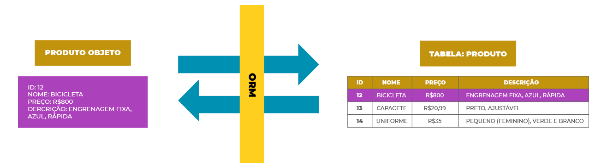
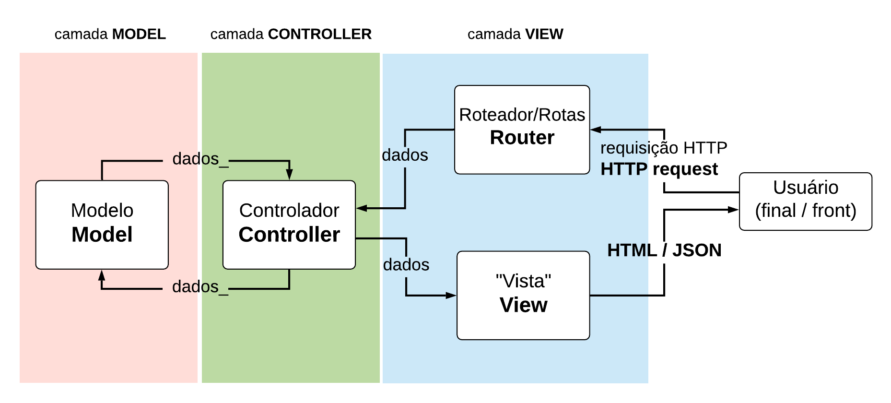

# API ORM - Control System for an English School

<a href="https://nodejs.org/en/" target="_blank"></a>
<a href="https://www.mysql.com/" target="_blank"></a>
<a href="https://sequelize.org/" target="_blank"></a>
<a href="https://www.postman.com/" target="_blank"></a>

### ORM (Object-Relational Mapping)

<p>Object-Relational Mapping (ORM) is a technique to bring the object-oriented application development paradigm closer to the relational database paradigm. The use of the object-relational mapping technique is performed through an object-relational mapper, which is usually a library or framework that helps in the mapping and use of the database. This technique helps you query and manipulate data from databases using an object-oriented paradigm. Currently, developers adopt the use of ORMs for several reasons such as:</p>
<li>We have to write a data model only in one place, it is easier to update, maintain and reuse the code;
<li>Forces you to write MVC code, which makes your code cleaner;
<li>No need to write SQL queries;
<li>No need for frequent database level changes;
<li>Most of the work is automated.

<p>When we are working with object-oriented applications that use relational databases to store information, we have a problem called object-relational impedance due to the differences between the 2 paradigms.</p>

<p>The relational database works with tables and relationships between them to represent real-life models. Inside the tables we have several columns and the unit we have for representation in the relational model is a row. The object-oriented paradigm has a slightly different way of working. In it we have several elements such as classes, properties, visibility, inheritance and interfaces. The unit when we talk about object orientation is the object that represents something from the real world, whether abstract or concrete</p>

<p>The main difficulties that these differences between paradigms cause:</p>
<li>Representation of the data and the model, as the structures are different;
<li>Mapping between programming language and database data types;
<li>Relational Database Relational Integrity Model.

### ORM
<p>Thinking about the problems described above, the ORM defines a technique to carry out the conciliation between the 2 models. One of the central parts is through mapping lines to objects:</p>



<p>ORM libraries or frameworks define how data will be mapped between environments, how it will be accessed and written. This shortens development time, as it is not necessary to develop all of this part. Another advantage is in the adaptation of new team members, as many commercial projects use the same tool, it is possible to find members who are already used to the work pattern.</p>

### The Data Mapper Pattern
<p>In this pattern, the class that represents the database table must not know the resources needed to carry out transactions with the database: inserting, updating and deleting information. These resources are in an ORM's own class, ensuring that the classes that represent the table have a single responsibility.</p>

<p>In practice, for most ORMs on the market that implement the Data Mapper pattern, regardless of language, we will have code very similar to the one below:</p>
```
class PessoaController {
  static async pegarTodasAsPessoas(req, res){
    try {
      const todasAsPessoas = await database.Pessoas.findAll()
      return res.status(200).json(todasAsPessoas)  
    } catch (error) {
      return res.status(500).json(error.message)
    }
  }
  static async pegarUmaPessoa(req, res) {
    const { id } = req.params
    try {
      const umaPessoa = await database.Pessoas.findOne( { 
        where: { 
          id: Number(id) 
        }
      })
      return res.status(200).json(umaPessoa)
    } catch (error) {
      return res.status(500).json(error.message)
    }
  }
}
```

### <a href="https://sequelize.org/" target="_blank">Sequelize</a>

<p>It is a well-known promise-based Node.js ORM that can be used with MySQL, MariaDB, SQLite and Microsoft SQL Server and Postgres. Sequelize provides a large set of features for developers and this library has become more famous because of these features. It allows creating, searching, altering and removing data from the database using JS methods, in addition to allowing the modification of the structure of the tables, with this we have a lot of ease in both the creation, population and database migration. It contains rich documentation, so if you are looking for a stable ORM for your project, sequelize is a good choice.</p>

### MVC (Model-View-Controller)
<p>MVC is an acronym for the English term Model View and Controller that facilitates the exchange of information between the user interface and the data in the database, making responses faster and dynamics.</p>

<p>What goes on behind a software login screen? In fractions of seconds, the page is able to absorb the information that was typed in the email and password field, perform the validation and deliver a positive or negative answer. This process is only possible when there is a suitable software architecture pattern. Although there are several that can be used, MVC is the most known and used among professional developers.</p>

<p>When we talk about MVC, each layer usually has the following responsibilities:</p>
<li><strong>Model</strong> Models are responsible for representing the business. It is also responsible for accessing and manipulating the data in your application.
<li><strong>View</strong> The view is responsible for the interface that will be presented, showing the model information to the user.
<li><strong>Controller</strong> It is the control layer, responsible for linking the model and the view, so that the models can be transferred to the views and vice versa.


 

```
.
├── api
│   ├── config
│   │   └── config.json
│   ├── controllers 
│   │   ├── NivelController.js
│   │   ├── PessoaController.js
│   │   └── TurmaController.js
│   ├── index.js
│   ├── migrations
│   │   ├── 20200505131114-create-pessoas.js
│   │   ├── 20200526194618-create-niveis.js
│   │   ├── 20200526194804-create-turmas.js
│   │   └── 20200526194858-create-matriculas.js
│   ├── models 
│   │   ├── index.js
│   │   ├── matriculas.js
│   │   ├── niveis.js
│   │   ├── pessoas.js
│   │   └── turmas.js
│   ├── routes
│   │   ├── index.js
│   │   ├── niveisRoute.js
│   │   ├── pessoasRoute.js
│   │   └── turmasRoute.js
│   └── seeders
│       ├── 20200505161755-demo-pessoa.js
│       ├── 20200601170039-demo-nivel.js
│       ├── 20200601170107-demo-turmas.js
│       └── 20200601170115-demo-matriculas.js
├── node_modules
├── .sequelizerc
├── package.json
└── package-lock.json

923 directories, 5307 files
```
<br>

Sources:

<a href="https://www.treinaweb.com.br/blog/o-que-e-orm" target="_blank">TreinaWeb</a> -
<a href="https://www.lewagon.com/pt-BR/blog/o-que-e-padrao-mvc" target="_blank">le wagon</a> -
<a href="https://dev.to/jhonywalkeer/orm-as-melhores-bibliotecas-para-javascript-2pc0" target="_blank">Dev</a>
  
&copy; Alura
